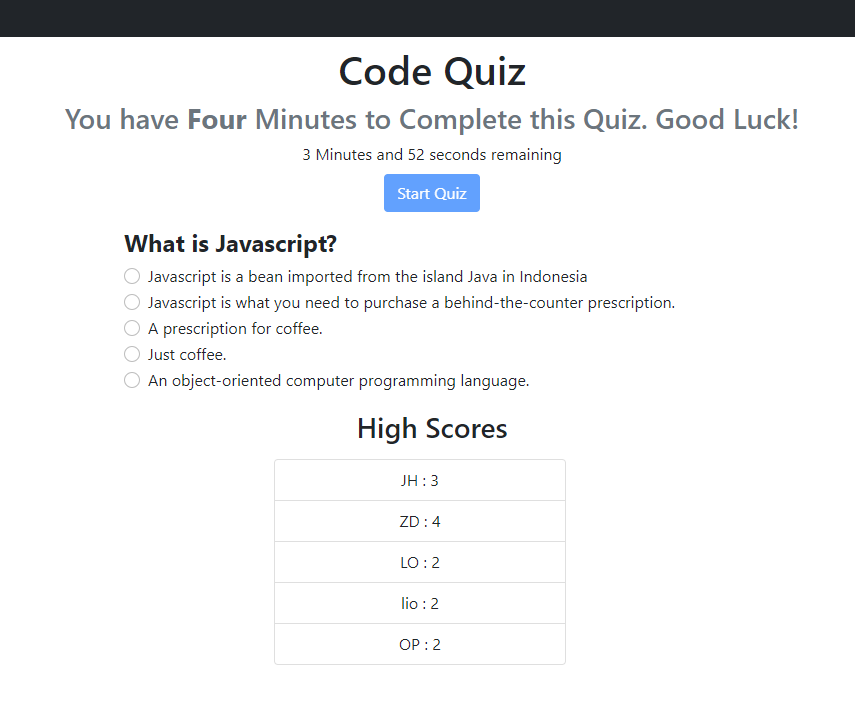

# Code-Quiz

This project is designed to display a timed Code Quiz with the following parameters.

- When the Quiz starts, a timer is displays and begins to count down
- Questions are then displayed
- After a question is answered, you are shown if your answer was correct or not, there is a brief pause, and then the next question is shown.
- If a question is answered incorrctly, 10 seconds are deducted from the timer
- When the Quiz is finished, the timer stops, you are prompted to enter your intials, and your score is displayed.
- When Initials are provided, the data is saved to local storage and displayed below the Quiz proper. 

